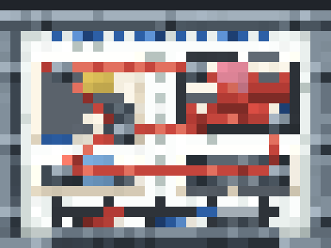

# investigation_board

墙挂式科学调查白板 —— 铁质细边框 + 白板面 + 图纸、便贴、图钉与红色证据链细绳。



## 规格

| 项目 | 值 |
| --- | --- |
| 格式 | `bedrock_block`（Bedrock Block，静态模型） |
| 尺寸 | 2 × 1.5 blocks = **32 × 24** 模型单位 |
| 边框 | 2 单位宽（细框），1 单位厚，内嵌白板面 28 × 20 |
| 纹理 | `investigation_board.png`，128 × 128 |
| 元素 | 23 cubes / 7 groups / 1 texture |

## 深度分层（分数坐标，z 轴朝向观众为 -Z）

| z | 内容 | 与上层间距 |
| --- | --- | --- |
| `0 … 1` | `board_panel` 白板面 + 2 单位宽铁框（前表面 z=0） | — |
| `-0.125` | 4 张纸质文件（倾斜 1.5–2°） | 0.125 |
| `-0.25` | 3 张便贴（黄/粉/蓝，倾斜 3–5°） | 0.125 |
| `-0.375` | **红色证据链细绳**（贴住纸面） | 0.125 |
| `-1 … 0` | 6 个 2×2×1 钢质图钉头 | 背面 z=0 直接贴住板面 |
| `-1 … 0` | 托盘 / 2 支马克笔 / 板擦 | — |

**图钉不悬空**：钉身 z ∈ [-1, 0]，背面与白板面（z=0）齐平接触；纸、便贴、细绳三个平面
（-0.125 / -0.25 / -0.375）全部落在钉身内部，被钉头真正压住（12 处合法 interior overlap，
每枚图钉遮住纸面 4 像素 + 绳子 1–3 像素）。

层间距 0.125 单位 ≈ 0.8cm，从任何角度看都是贴合的。

## 内容

- **文件**（4 张，带轻微旋转）：调查报告（标题条 + 文字行 + 灰度插图 + 红章）、现场照片、数据曲线图、标本照片
- **便贴**（3 张）：黄 / 粉 / 蓝，带手写笔迹与卷角
- **图钉**（6 枚）：分布在各文件四角
- **证据链**：7 段细绳连成网络（横、竖、斜），穿过图钉之间
- **白板面**：擦不净的 ghost 痕迹、蓝色虚线草图、底部调查时间轴（刻度 + 红/蓝标记点）
- **托盘**：2 支马克笔 + 板擦

## 文件

```
src/model.body.js     几何 + 图集像素图（含分数坐标分层、旋转、证据链遮罩生成）
src/texture.body.js   纹理绘制（金属、纸张、照片、便贴、绳索）
model.js / texture.js 由 build.sh 组装（runtime + body）
investigation_board.bbmodel   工程文件
investigation_board.png       弥散纹理
```

## 重建

```bash
./build.sh
```

然后在 Blockbench MCP 中依次执行 `model.js` → `texture.js`（仅改配色可只跑 `texture.js`）。
`model.js` 开头会清理遗留的 `cube_*` / `group_*` 节点，重复执行不会叠加。

## 坐标约定

所有跨度仍是整数网格；分数坐标只用于**分层间距**（0.5 / 0.25）与**旋转原点**，均带 `fractionalReason`；
非 22.5° 倍数的旋转带 `angleReason`。
