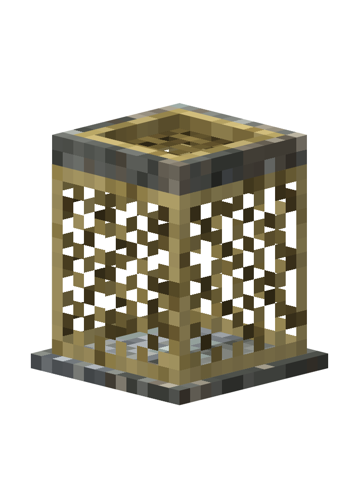

# sieve（筛子）

海底考古用的**立式筛选器**方块模型：石头底座上立着一个**高高的编织网兜**（空的，能看穿），
网兜口上架着一张**细边框（1 像素）的石筛盘**，筛盘可以左右平动 —— 动画就是它正在晃筛子。
整机**严格一格高**（16/16），最低面就在基准平面上。



## 规格

| 项目 | 值 |
| --- | --- |
| 格式 | `bedrock`（Bedrock Entity，**带动画**） |
| 尺寸 | 14 × 14 × **16** 模型单位（一格高；底面中心 = 世界原点，居中偏移 0） |
| 纹理 | `sieve.png`，128 × 64 |
| 元素 | 21 cubes（含 5 张零厚度网片 + 1 张筛网）/ 2 groups / 1 texture |
| 动画 | `sieve_animation_sift`，1.0 s，loop，21 个关键帧（position，bone `group_tray`） |

## 结构（y 从方块底面算起）

| 部位 | y | 说明 |
| --- | --- | --- |
| **石底座** | `0 … 1` | 14 × 14 × 1 的**整块石台**，封住底部、不透明；贝壳石灰岩 |
| **编织网兜** | `1 … 14` | 12 × 12 × 13 的镂空网兜：四面各一张网片（菱形网眼 + 上下收口绳 + 两侧缝边），**内部是空的，可以看穿** |
| **石筛盘** | `14 … 16` | 12 × 12 石框，**边框只有 1 像素宽**（10 块砌石，接缝错开） |
| **海藻绳箍** | `14 … 16` | 框内侧 1 像素宽的金褐色绳圈（4 段），压住网边 |
| **编织筛网** | `15` | 8 × 8 零厚度网面，1 像素纤维 + 1 像素真空网眼 |

整机 **21 个元素、210 次重叠检查、0 处表面重叠**；所有坐标都是整数，没有任何分数坐标。

碰撞箱 / 选择框**贴住模型**，两段：`y 0 … 1` 是 14 × 14 的石底座，`y 1 … 16` 是
12 × 12 的「网兜 + 筛盘」立柱。筛盘左右各 2 单位的行程只是动画，**不进碰撞箱** ——
否则顶部会多出一圈框住空气的线框（底座上方筛盘扫过、但任何时刻都没有实体经过的那两条边）。

## 动画

`group_tray`（筛盘那一组）做三轴复合平动，1 秒一循环：

| 通道 | 曲线 | 作用 |
| --- | --- | --- |
| x | `2 · sin(2π·2t)` | 主运动：左右各 2 单位的快速往复（2 次/秒） |
| y | `0.08 + 0.08 · sin(2π·4t + π/2)` | 次级：每次往返到两端抬一下（只在 0 以上，绝不压进网兜） |
| z | `0.12 · sin(2π·t + π/3)` | 三级：错相 1/3 周期的前后微漂 |

- 用 `sampleLoopKeyframes` 采样 21 个等间隔关键帧（catmullrom），首尾是同一个周期采样，
  速度在接缝处连续 —— 循环是「周期轨迹被切开」，不是复位帧。
- 运行时在 20 tick 的每个采样点 + 关键帧时间 + 两个循环端点都做了动画姿态重叠检查：
  `animatedOverlapChecks: 4410`，**0 处表面重叠**，动画过程中筛盘不会插进网兜。
- 筛盘的行程与网兜口对齐：筛网 8 宽、±2 的行程 → 恰好扫过网兜口 12 宽的范围，东西不会漏到兜外。

## 材质（全部在 texture.js 里程序化生成）

| 材质 | 表现手法 |
| --- | --- |
| 普通石 | 冷灰 / 暖灰 / 蓝灰三套 6 级灰阶，圆弧隆起高光 + 矿物斑点 + 湿痕，逐块随机 |
| **贝壳石灰岩** | 底座整块用贝壳岩：浅暖底色 + 白色珠母碎屑 + 弧形裂纹 |
| 干燥海藻纤维 | 绳箍：斜向扭绞明暗带；筛网：经纬按奇偶分「压 / 被压」；网兜：两组对角纤维分「受光 / 背光」，交点当绳结压暗，四边是收口绳与缝边 |
| 网眼 | 网兜与筛网都用 mask 里的 `_` 像素做**真透明**（网兜约 55% 开孔），所以能看穿兜里 |

## 文件

```
src/model.body.js        几何 + 图集像素遮罩（底座、网兜、筛盘、绳箍、筛网）
src/texture.body.js      纹理绘制（岩性分配、贝壳碎屑、绳扭纹、编织纹、网眼）
src/animation.body.js    动画（筛盘三轴平动循环）
model.js / texture.js / animation.js   由 build.sh 组装的完整脚本（runtime + body）
sieve.bbmodel            工程文件
sieve.geo.json           Bedrock 几何
sieve.animation.json     Bedrock 动画（animation.sieve.sift）
sieve.png                弥散纹理（128 × 64）
preview_*.png            预览图
tools/shot.js            本机截图辅助脚本（在 Blockbench 里 eval）
```

## 重建

```bash
./build.sh
```

然后在 Blockbench MCP 中**依次**执行 `model.js` → `texture.js` → `animation.js`。
注意：动画需要 `bedrock`（Bedrock Entity）格式的工程（`bedrock_block` 没有 animation mode）。
两个几何/纹理脚本开头都会清理遗留的 `cube_*` / `group_*` 节点，重复执行不会叠加。

## 已接入模组（无功能，纯展示 + 循环动画）

方块 ID `aquanaut:sieve`，中文名「筛子」，英文名「Sifting Sieve」。

| 类型 | 文件 |
| --- | --- |
| 方块 | `common/block/SieveBlock.java`（BaseEntityBlock；碰撞箱 / 选择框贴住模型：「网兜 + 筛盘」12 × 12 立柱 + 14 × 14 石底座，共 2 段） |
| 方块实体 | `common/block/entity/SieveBlockEntity.java`（GeoBlockEntity；`AnimationController` 常驻循环 `animation.sieve.sift`） |
| 客户端模型 | `client/model/SieveGeoModel.java`（geo + 纹理 + 动画资源） |
| 客户端渲染器 | `client/renderer/SieveBlockEntityRenderer.java`（GeoBlockRenderer） |
| 注册 | `BlockRegistry.SIEVE`、`BlockEntityRegistry.SIEVE`、`ItemRegistry.SIEVE`（环境页「结构」分类）、`ClientModEvents` 渲染器注册 |
| 资源 | `geo/sieve.geo.json`、`animations/sieve.animation.json`、`textures/block/sieve.png`、`textures/item/sieve.png`、`blockstates/sieve.json`、`models/block|item/sieve.json` |
| 数据 | `data/aquanaut/loot_table/blocks/sieve.json`、pickaxe 标签 |
| 语言 | `lang/en_us.json`、`lang/zh_cn.json` |

进游戏查看：`./gradlew runClient` → 创造模式「环境」页 → 「结构」分类。
